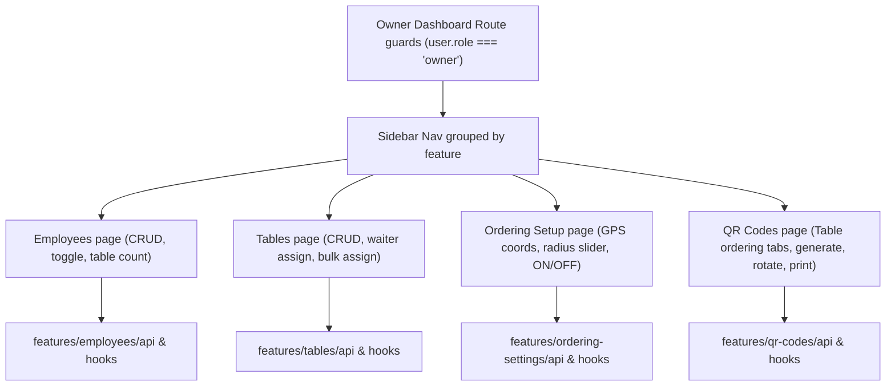

# Owner Website Ordering Management Phase 1 Walkthrough

We have successfully implemented Phase 1 ordering management capabilities for the restaurant owner dashboard. All features have been aligned with the backend `loyalty-backend` schemas and REST routes, maintaining full type-safety and visual consistency.

## Overview of Changes

## Changes Made

### 1. Hardened Authorization & Route Security

- **Zustand Session Retention**: Modified partialize configuration in `src/store/auth.store.ts` to persist `user` in `localStorage` so role checks are validated immediately on hard refresh rather than waiting for profile fetch.
- **Strict Role Check**: Added route protection `beforeLoad: requireOwner` on all dashboard routes so only authenticated users with `user.role === "owner"` can access the admin dashboard.
- **Sidebar Logout**: Standardized the sidebar logout handler to clear Zustand state and TanStack query client cache, redirecting to `/login` without legacy local storage manipulation.

### 2. Form Registration & Billing Hardening

- **Self-registration Disabled**: Isolated the register page (`src/routes/register.tsx`) to disable self-registration for the `owner` role, rendering an informative admin-onboarding notice advising owners to obtain accounts through admin provisioning.
- **Read-Only Billing**: Made the pricing plans and upgrades read-only in `src/routes/billing.tsx` and the limit modal in `src/routes/__root.tsx`, instructing owners to upgrade subscription tiers via platform support.
- **Cleaned legacy setup**: Deleted `src/routes/employee-setup.tsx` legacy registration code since staff registration is strictly managed via the owner-controlled employee API.

### 3. Modular Feature Structure

Created modular directories in `src/features/` with types, api callers, and TanStack query hooks:

- **`src/features/employees`**: API/hooks to query, create, and update roles/active state.
- **`src/features/tables`**: API/hooks for tables CRUD, waiter assignment, and bulk table-waiter assignments.
- **`src/features/ordering-settings`**: API/hooks to fetch and patch restaurant coordinates and radius.
- **`src/features/qr-codes`**: API/hooks to generate, rotate, and revoke secure table order QR codes.

### 4. Interactive UI Features

- **Employee Setup Upgrade**: Added role dropdowns ("Chef", "Waiter", "Cashier"), active/inactive toggles, table assignment count indicators, and deactivation warning confirm modals.
- **Tables setup**: Implemented listing table statuses, creating tables (case-insensitive duplicate check), editing details, toggle active states, waiter assignment dropdowns (only lists active waiters), and a checkbox-based bulk waiter assignment modal.
- **Ordering Setup**: Form inputs for coordinates (latitude, longitude) and radius (30m–200m slider). Added geolocation coordinate capture utilizing high-accuracy browser location and accuracy reporting.
- **QR Codes upgraded**: Distinguishes between Table Ordering QR, Loyalty QR, and Menu QR tabs. Table ordering QRs support generation of secure, single-use tokens from the backend, printing decorated QR labels with table details, and revoking/rotating active QR credentials.
